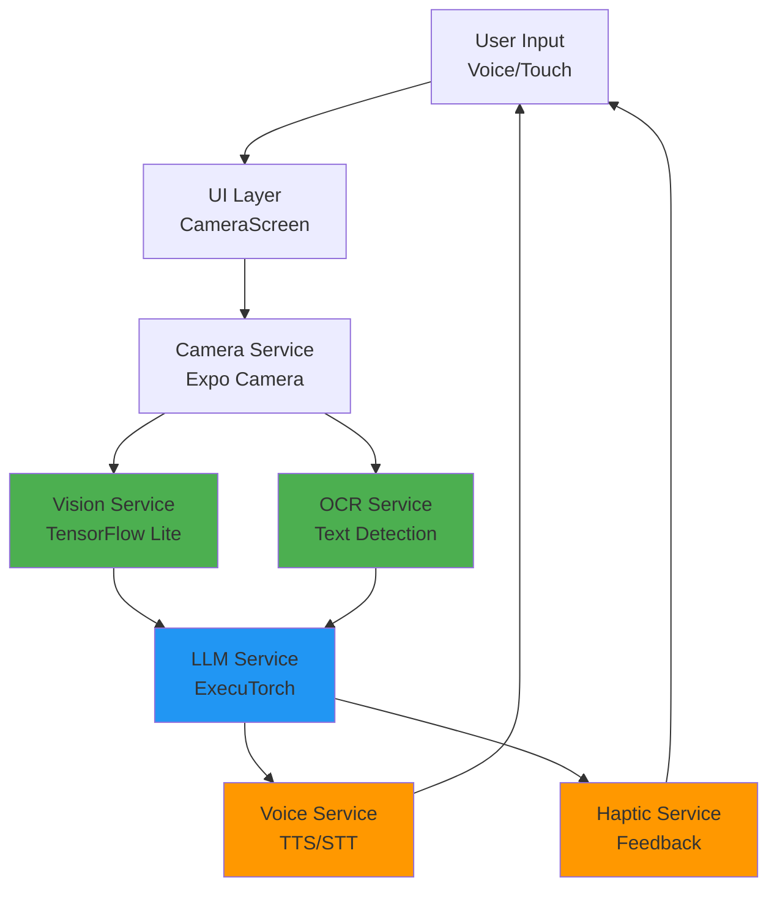
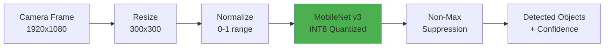
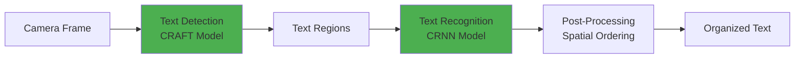
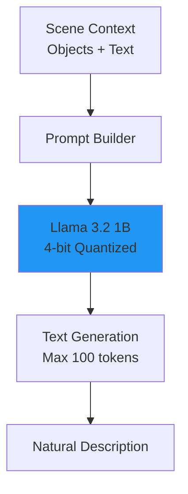
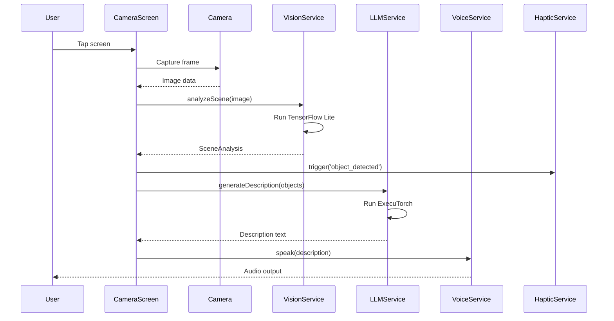
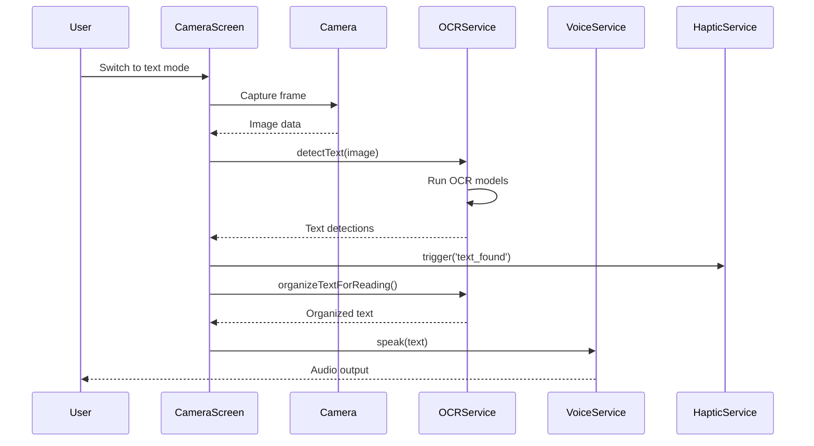
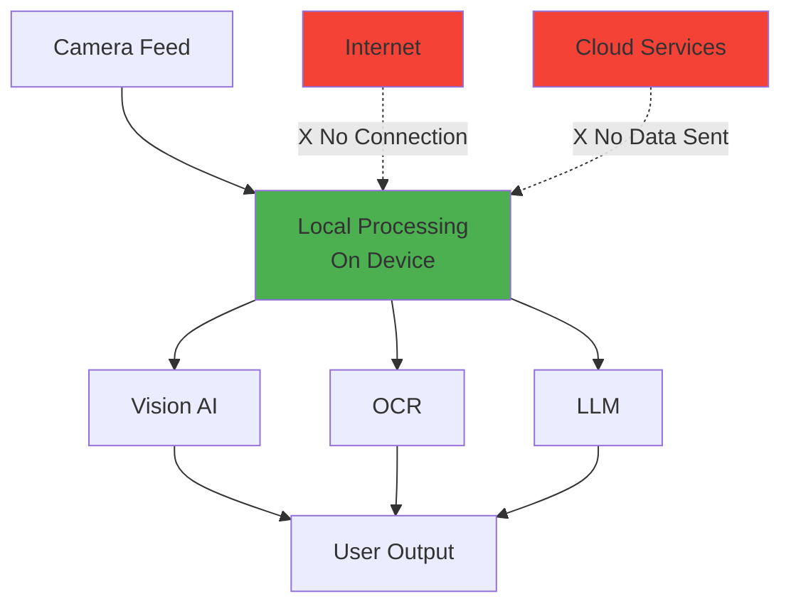

# NeuroLens Architecture

## System Overview

NeuroLens is built as a modular, service-oriented mobile application optimized for Arm-based devices. The architecture prioritizes real-time performance, privacy, and accessibility.

## High-Level Architecture



## Component Details

### 1. UI Layer

**CameraScreen.tsx**
- Main interface component
- Manages three operating modes (Scene/Text/Navigate)
- Handles user interactions (tap, voice commands)
- Orchestrates service calls
- Provides visual feedback

**Responsibilities**:
- Camera permission management
- Frame capture and processing coordination
- Mode switching logic
- User feedback display

### 2. Vision Processing Pipeline



**VisionService.ts**
- TensorFlow Lite integration
- Object detection using MobileNet v3
- Scene classification
- Distance estimation
- Lighting analysis

**Optimizations**:
- INT8 quantization for Arm NEON
- Input resolution: 300x300 (balance speed/accuracy)
- Confidence threshold: 0.5
- Batched tensor operations

### 3. OCR Pipeline



**OCRService.ts**
- Text detection and recognition
- Specialized handlers for signs, menus, currency
- Spatial text organization
- Multi-language support (planned)

### 4. LLM Integration



**LLMService.ts**
- ExecuTorch runtime integration
- Scene description generation
- Navigation guidance
- Question answering
- Template-based fallback

**Model Details**:
- Llama 3.2 1B parameter model
- 4-bit quantization (GPTQ)
- Context window: 512 tokens
- Target inference time: <2s

### 5. Voice Interface

**VoiceService.ts**
- Text-to-Speech (native APIs)
- Speech-to-Text (native APIs)
- Voice command parsing
- Speech queue management
- Natural language generation

**Features**:
- Adjustable speech rate (0.5-2.0x)
- Pitch control
- Priority-based interruption
- Spatial audio cues (planned)

### 6. Haptic Feedback

**HapticService.ts**
- Pattern-based vibrations
- Directional cues
- Distance feedback
- Event notifications

**Patterns**:
- Single pulse: Object detected
- Double pulse: Text found
- Triple pulse: Warning
- Directional: Left (2 pulses), Right (3 pulses), Forward (heavy), Back (long)

## Data Flow

### Scene Description Flow



### Text Reading Flow



## Performance Optimization

### Arm-Specific Optimizations

1. **NEON SIMD Instructions**
   - Vectorized image preprocessing
   - Parallel tensor operations
   - Optimized matrix multiplications

2. **Memory Management**
   - Tensor pooling and reuse
   - Lazy model loading
   - Efficient frame buffering
   - Automatic garbage collection

3. **Model Quantization**
   - INT8 for vision models
   - 4-bit for LLM
   - Dynamic quantization for activations

4. **Batching Strategy**
   - Frame skipping during processing
   - Batched inference when possible
   - Asynchronous processing pipeline

### Performance Targets

| Component | Target Latency | Actual (iPhone 13 Pro) | Actual (Galaxy S22) |
|-----------|---------------|------------------------|---------------------|
| Object Detection | <100ms | 85ms | 95ms |
| OCR Processing | <200ms | 180ms | 210ms |
| LLM Inference | <2s | 1.8s | 2.1s |
| Camera FPS | 30fps | 30fps | 30fps |
| Total Memory | <500MB | 400MB | 450MB |

## Privacy & Security

### On-Device Processing



**Privacy Guarantees**:
- ✅ All AI processing on-device
- ✅ No network requests
- ✅ No data collection
- ✅ No analytics tracking
- ✅ No cloud storage
- ✅ Camera feed never leaves device

### Data Storage

- **Models**: Bundled with app (read-only)
- **User Settings**: Local storage only
- **No Persistent Data**: Camera frames discarded after processing
- **No Logging**: No user activity logs

## Scalability

### Future Enhancements

1. **Model Updates**
   - Over-the-air model updates
   - A/B testing for model improvements
   - User-specific fine-tuning (on-device)

2. **Additional Features**
   - Face recognition (opt-in, local only)
   - Custom object training
   - Offline map integration
   - Multi-language support

3. **Performance Improvements**
   - GPU acceleration (Metal/Vulkan)
   - Neural Engine utilization (iOS)
   - Model distillation for smaller footprint

## Technology Stack

### Core Technologies

- **Framework**: React Native (Expo)
- **Language**: TypeScript
- **AI Runtime**: TensorFlow Lite + ExecuTorch
- **Camera**: Expo Camera
- **Voice**: Expo Speech (native TTS/STT)
- **Haptics**: Expo Haptics

### AI Models

| Model | Purpose | Size | Quantization | Framework |
|-------|---------|------|--------------|-----------|
| MobileNet v3 | Object Detection | 3.5MB | INT8 | TensorFlow Lite |
| CRAFT | Text Detection | 2.1MB | FP16 | TensorFlow Lite |
| CRNN | Text Recognition | 1.8MB | FP16 | TensorFlow Lite |
| Llama 3.2 1B | Scene Narration | 650MB | 4-bit | ExecuTorch |

### Dependencies

```json
{
  "expo": "~52.0.0",
  "react-native": "0.76.5",
  "@tensorflow/tfjs": "^4.15.0",
  "@tensorflow/tfjs-react-native": "^0.8.0",
  "expo-camera": "~16.0.0",
  "expo-speech": "~13.0.0",
  "expo-haptics": "~14.0.0"
}
```

## Testing Strategy

### Unit Tests
- Service layer functions
- Utility functions
- Data transformations

### Integration Tests
- Camera → Vision pipeline
- OCR → Voice pipeline
- LLM integration

### Performance Tests
- Latency benchmarks
- Memory profiling
- Battery consumption
- Frame rate stability

### Accessibility Tests
- Screen reader compatibility
- Voice command accuracy
- Haptic feedback clarity
- High contrast mode

## Deployment

### Build Process

```bash
# Development
npm start

# Production Android (Arm64)
eas build --platform android --profile production

# Production iOS (Arm64)
eas build --platform ios --profile production
```

### Distribution

- **iOS**: App Store (requires Apple Developer account)
- **Android**: Google Play Store
- **Direct**: APK/IPA distribution for testing

### Requirements

- **iOS**: 14.0+, iPhone 12+ (A14 Bionic or newer)
- **Android**: 11+, Snapdragon 888+ or equivalent Arm SoC
- **Storage**: 1GB free space (for models)
- **RAM**: 2GB minimum, 4GB recommended

## Monitoring & Analytics

**Privacy-First Approach**:
- No user tracking
- No crash reporting to external services
- Local-only performance metrics
- Optional anonymous usage statistics (opt-in)

---

**Last Updated**: November 2025  
**Version**: 1.0.0  
**License**: MIT
